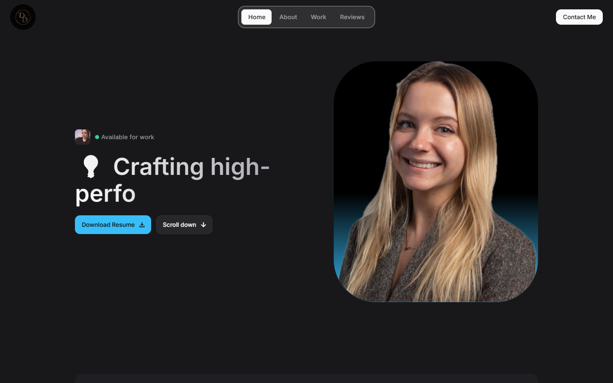

# Daryna Diaz — Portfolio Website

Personal portfolio and resume website showcasing my skills, projects, and experience as a Full-Stack Web Developer.

🌐 **Live site:** [daryna-diaz.netlify.app](https://daryna-diaz.netlify.app/)

---

## About This Project

Built to highlight my work and technical expertise in web development. Features smooth scroll animations, responsive design, and a clean dark UI.

## Technologies Used

**Frontend**
- React.js
- Tailwind CSS
- JavaScript (ES6+)
- GSAP — scroll-triggered animations
- Lenis — smooth scrolling

## Featured Projects

| Project | Description | Live |
|---|---|---|
| Klassiki — LG WebOS TV App | Smart TV streaming app built for Klassiki, packaged as a native WebOS .ipk | [klassiki.netlify.app](https://klassiki.netlify.app/) |
| Wedding Website & Invitation | Full-stack wedding site with RSVP, event details, and photo gallery | [djwedding.netlify.app](https://djwedding.netlify.app/) |
| Impactify — Civic Engagement App | Community event platform with donations and Google Maps integration | [group2app.netlify.app](https://group2app.netlify.app/) |

## Features

- Fully responsive — works on all devices
- Scroll-triggered animations with GSAP
- Downloadable resume
- Contact form via Getform
- Netlify SPA routing

## Connect

- [LinkedIn](https://www.linkedin.com/in/daryna-v-17469169/)
- [GitHub](https://github.com/Smille007)
- [Instagram](https://www.instagram.com/smille007)
